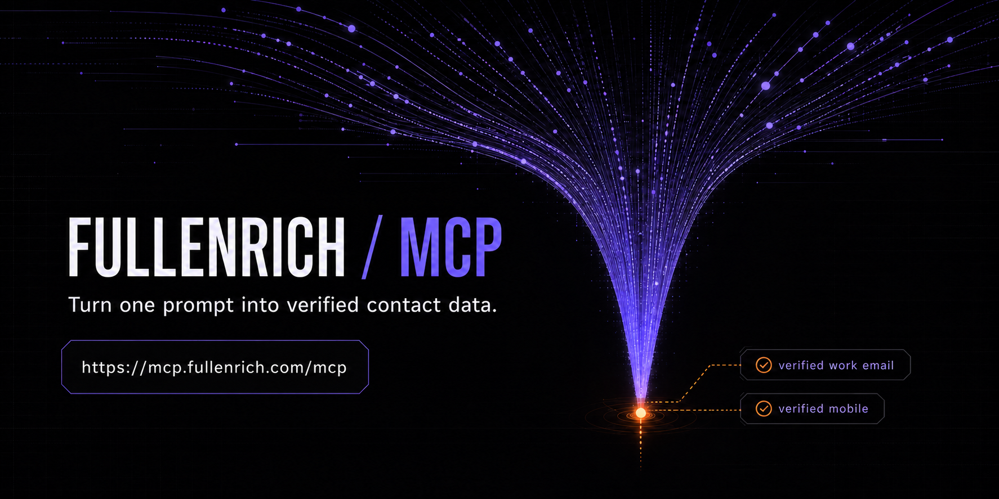

# FullEnrich MCP

<p align="center">
  
</p>

<p align="center">
  <strong>Verified B2B contact data, directly inside your AI agent.</strong>
</p>

<p align="center">
  <a href="https://github.com/FullEnrich/fullenrich-skills/releases"></a>
  <a href="./LICENSE"></a>
</p>

FullEnrich MCP lets an AI agent search for B2B people and companies, enrich verified work emails and mobile numbers, and export the results without leaving the conversation.

## Connect in under a minute

Add this custom remote MCP URL to your AI client:

```text
https://mcp.fullenrich.com/mcp
```

Then:

1. Sign in with your FullEnrich account through OAuth.
2. Ask the agent to check your credits or preview a search.
3. Confirm before any paid enrichment or export.

Try:

> Find VP Sales at software companies in France, show me a preview, then enrich 10 contacts after I confirm.

## Works with your AI platform

FullEnrich is available as a **custom remote MCP connection** wherever the client supports remote Streamable HTTP servers and OAuth.

| Platform | How to connect |
|---|---|
| **Claude** | Add the endpoint as a custom connector on supported Claude plans, or install the Claude Code plugin below. |
| **ChatGPT** | Create a custom MCP app in ChatGPT developer mode. Availability and permissions depend on the workspace plan. |
| **Grok** | Add the endpoint from Grok's **Connectors → New Connector → Custom** flow. |
| **Gemini** | Use the remote MCP server from the Gemini API or install the Gemini CLI extension below. |
| **Other MCP clients** | Add the endpoint to any client that supports remote Streamable HTTP and OAuth. |

These are custom MCP connections. They do not imply a native marketplace listing. Platform availability, plan requirements, and permissions are controlled by each client.

## What the agent can do

```text
Your prompt
    ↓
Search people or companies
    ↓
Preview results and check credits
    ↓
Confirm a paid action
    ↓
Run waterfall enrichment
    ↓
Return or export verified results
```

- **Search first.** Find the right people or companies with structured filters.
- **Enrich second.** Run waterfall enrichment for verified work emails and mobile numbers.
- **Export when ready.** Download contact, company, or enrichment results as CSV or JSON.
- **Keep control.** FullEnrich shows the credit boundary before paid actions.

## 13 MCP tools

### Account and filter metadata

| Tool | What it does |
|---|---|
| `get_credits` | Returns the current credit balance before paid actions. |
| `list_industries` | Lists valid industry codes and labels for company filters. |
| `list_seniorities` | Lists valid seniority levels for people filters. |
| `list_functions_subfunctions` | Lists valid function and subfunction codes for people filters. |

### Search

| Tool | What it does |
|---|---|
| `search_people` | Searches people with structured contact and company filters. |
| `search_companies` | Searches companies with structured company filters. |
| `search_contact_by_email` | Finds a contact from an email address. |

### Enrichment

| Tool | What it does |
|---|---|
| `enrich_search_contact` | Enriches contacts matching search filters with verified emails and phones. |
| `enrich_bulk` | Enriches multiple known contacts in one batch. |
| `get_enrichment_results` | Polls status and fetches async or bulk enrichment results. |

### Export

| Tool | What it does |
|---|---|
| `export_contacts` | Exports contact search results to CSV. |
| `export_companies` | Exports company search results to CSV. |
| `export_enrichment_results` | Exports enrichment job results to CSV or JSON. |

See the [complete MCP server reference](./fullenrich-mcp-documentation.md) for behavior, limitations, and reviewer guidance.

## MCP plus guided skills

The MCP server exposes reliable tools. The plugin adds nine skills that teach compatible agents how to combine those tools into complete workflows.

| Skill | Workflow |
|---|---|
| `full-prospecting` | Find and enrich contacts matching an ICP. |
| `full-csv` | Bulk-enrich a CSV with verified emails and phone numbers. |
| `full-outreach` | Draft personalized emails, LinkedIn messages, and call scripts from enriched data. |
| `full-sequence` | Design multi-touch outreach sequences with confirmation safeguards. |
| `full-meeting` | Prepare a meeting brief with person and company context. |
| `full-talent` | Source, enrich, and rank candidates for a role. |
| `full-lookalike` | Find people similar to a reference LinkedIn profile. |
| `full-org` | Map a company's team and identify relevant contacts. |
| `full-crm` | Coordinate a separately connected CRM MCP after explicit confirmation. |

Invoke a skill directly, such as `/full-prospecting`, or describe the outcome you want and let the client select the workflow.

## Installation options

### Claude Code plugin

Install the remote MCP connection and all nine skills:

```text
/plugin marketplace add FullEnrich/fullenrich-skills
/plugin install fullenrich@fullenrich
```

### Cursor local plugin

Cursor loads root Agent Plugins from `~/.cursor/plugins/local`:

```sh
mkdir -p ~/.cursor/plugins/local
git clone https://github.com/FullEnrich/fullenrich-skills ~/.cursor/plugins/local/fullenrich
```

Alternatively, copy the complete repository directly into `~/.cursor/plugins/local/fullenrich`.

Restart Cursor or run `Developer: Reload Window`, then verify that the nine skills and the `fullenrich` MCP server appear. The package is not yet listed in the Cursor Marketplace.

### Gemini CLI extension

```sh
gemini extensions install https://github.com/FullEnrich/fullenrich-skills
```

Gemini CLI loads the remote MCP server and the nine skills. Authenticate with FullEnrich on the first connection.

The package is not yet listed in the Gemini CLI extension gallery. Gallery discovery also requires the `gemini-cli-extension` GitHub topic.

Antigravity CLI can convert the installed Gemini extension into a native plugin:

```sh
agy plugin import gemini
```

### Other Agent Plugins clients

The repository root follows Agent Plugins 1.0. Point a compatible client's local plugin loader at this directory. Installation remains client-specific.

## Technical details

| Property | Value |
|---|---|
| Endpoint | `https://mcp.fullenrich.com/mcp` |
| Transport | Streamable HTTP |
| Authentication | OAuth 2.1 browser flow |
| Static API key | Not required |
| Tools | 13 |
| Guided skills | 9 |
| Registry name | `io.github.FullEnrich/fullenrich` |

The official MCP Registry listing is active at **v1.0.3**.

Minimal configuration:

```json
{
  "mcpServers": {
    "fullenrich": {
      "type": "streamable-http",
      "url": "https://mcp.fullenrich.com/mcp"
    }
  }
}
```

## Credits, confirmations, and safety

- Checking credits is free.
- Search previews are free within the MCP preview limit.
- Enrichment and exports can consume credits.
- Preview the scope and check the balance before larger runs.
- Require explicit confirmation before paid enrichment, exports, or batch actions.

## Capability boundary

FullEnrich MCP searches B2B people and companies, enriches contacts, and exports results as CSV or JSON. It has no CRM write tools.

The `full-crm` skill can orchestrate a separately connected CRM MCP. It checks field mapping and duplicates, then requires explicit confirmation before the separate CRM connector creates or updates records.

## What's in this repository

- `plugin.json` — portable Agent Plugins 1.0 manifest
- `mcp.json` — portable Streamable HTTP MCP configuration
- `server.json` — active official MCP Registry metadata for `io.github.FullEnrich/fullenrich`
- `gemini-extension.json` — Gemini CLI extension manifest
- `.claude-plugin/` — Claude Code plugin and marketplace manifests
- `.mcp.json` — Claude-compatible remote MCP configuration
- `skills/` — the nine guided skills
- `fullenrich-mcp-documentation.md` — complete MCP tool reference

## Links

- [FullEnrich](https://fullenrich.com)
- [Documentation](https://docs.fullenrich.com)
- [Help center](https://help.fullenrich.com)
- [Pricing](https://fullenrich.com/pricing)
- [Privacy policy](https://fullenrich.com/privacy-policy)
- [Trust Center](https://fullenrich.com/trust)
- [Support](mailto:support@fullenrich.com)
- [MCP server reference](./fullenrich-mcp-documentation.md)
